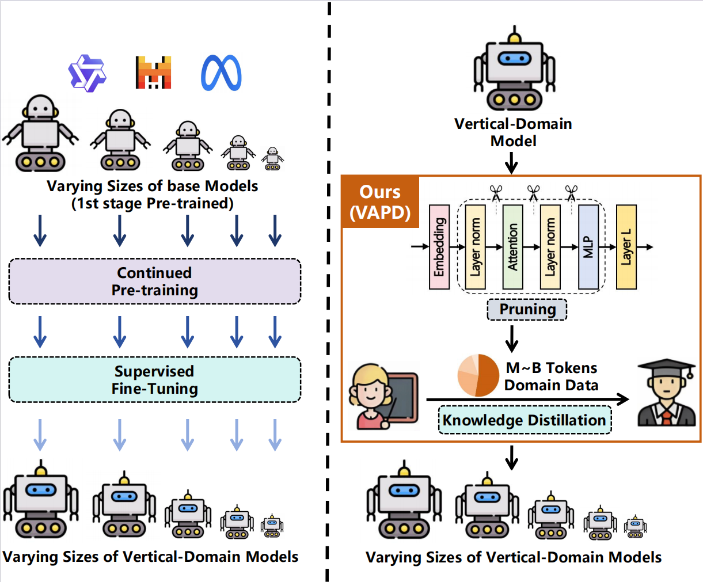
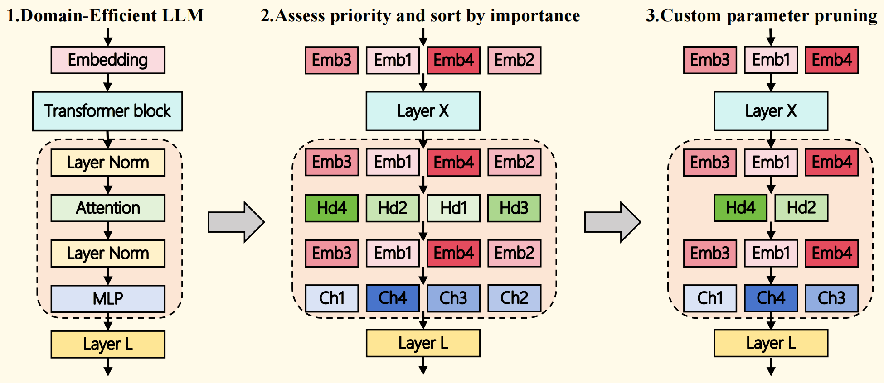

# VAPD: Vertical-Adapted Pruning and Distillation

> Official repository for the paper  
> **"From One to Many: Efficient Production and Deployment of Vertical LLM Families via Pruning and Distillation"**

VAPD is a **One-to-Many** framework that derives lightweight, hardware-optimized LLM variants from a single vertical foundation model via structured pruning and knowledge distillation. It eliminates the prohibitive cost of per-scale Continued Pre-training (CPT), enabling industrial-scale production of vertical-domain LLM families.

Since July 2025, VAPD has powered Sangfor Technologies' production XDR through five variants (0.8B–7B), serving **millions of daily requests** across cloud, on-premise, and edge environments.

---

## 🎯 The Industry Problem VAPD Solves

Deploying LLMs in vertical domains—cybersecurity, finance, healthcare, law—is fundamentally different from deploying them in the open consumer market. Two constraints collide:

1. **Heterogeneous hardware.** A single product line spans cloud SaaS (A100/A800), on-premise appliances (RTX 4090/4080), and edge nodes (RTX 3090/3080). Each tier demands a different model size.
2. **Domain specialization.** Generic open-source LLMs underperform on specialized tasks; closing the gap requires Continued Pre-training (CPT) on hundreds of billions of domain tokens.

The conventional approach is to run CPT independently for each scale. For a 5-variant family this means CPT × 5 — a **14,412 GPU-hour** investment that puts industrial multi-scale deployment out of reach for all but the largest budgets.

**VAPD breaks this `O(N)` cost barrier**, reducing total family cost to **5,567 GPU-hours (61.4% reduction)** and **marginal per-variant cost by 97% (2,747 → 81 GPU-hours)**, while matching or exceeding the accuracy of the conventional CPT-per-scale pipeline.

<p align="center">
  
  <br>
  <em>Conventional adaptation (left) performs full-scale CPT independently for every target size — an O(N) training problem. VAPD (right) trains a single high-performance vertical teacher, then derives every smaller variant from it via structured pruning and knowledge distillation — collapsing the cost to O(1).</em>
</p>

---

## 🔑 Key Results

- **97% reduction** in marginal derivation cost per variant (2,747 → 81 GPU-hours)
- **61.4% reduction** in total five-model family cost (14,412 → 5,567 GPU-hours)
- **5 production variants** deployed in Sangfor Athena XDR (0.8B / 1.5B / 3B / 4.5B / 7B)
- VAPD-derived 3B model recovers **92% of teacher performance** with only **41% of the parameters**
- Custom 4.5B variant matches the 7B teacher's accuracy while delivering **2.125× higher throughput** and **1.582× lower latency**

---

## 🧠 Why VAPD Works: The Core Insight

Generic compression methods (SparseGPT, LLM-Pruner, Minitron, DepGraph) were designed for **general** language capabilities, where knowledge is broadly distributed across parameters. Vertical-domain knowledge is fundamentally different: it forms **localized, sparse, long-tailed regions** in parameter space. Neurons critical to detecting a rare attack pattern may be **rarely activated yet essential**.

Applied naively, magnitude-based pruning silently discards exactly these neurons — eroding the specialized capability that makes the model valuable in the first place.

VAPD's design starts from this observation and addresses it through three coordinated contributions:

### 1. Importance estimation that *sees* sparse domain neurons

We use first-order Taylor expansion `|∇_w L · w|` instead of activation magnitude — gradient sensitivity decouples importance from numerical weight, allowing low-magnitude but high-impact domain neurons to be preserved.

Critically, the calibration data on which gradients are computed is **a mixture of domain-specific and general-domain instances**. The domain subset anchors the gradient to the target task; the general subset acts as a regularizer. The result: domain-specialized parameters get amplified gradients and are shielded from removal, while generic parameters with attenuated gradients are preferentially discarded.

### 2. Dependency-aware pruning order

Standard pruning treats structural dimensions as independent. VAPD identifies a strict ordering dependency: the LayerNorm feature dimension `C` defines the **global feature manifold** propagated through residual connections; the MLP intermediate dimension `D_h` defines **local transformation capacity**.

Pruning `C` first constrains the global subspace to its most informative components, *forcing adjacent matrices to realign* before their internal redundancy is addressed. The subsequent `D_h` pruning then optimizes local capacity within a stable manifold — rather than chasing a moving target.

<p align="center">
  
  <br>
  <em>VAPD pruning workflow: (1) start from the domain-adapted foundation model; (2) assess parameter importance via gradient-based Taylor scores and sort by structural group; (3) custom-prune the lowest-ranked components, with the pruning ratio tunable to fit any target hardware budget.</em>
</p>

### 3. Adaptive distillation for capability recovery

After pruning, knowledge distillation restores capacity — but standard KL-only distillation propagates teacher hallucinations into the student, a critical failure mode in vertical domains. VAPD uses a hybrid `α·L_KL + (1-α)·L_CE` objective, where `α` is **domain-tunable**: pure KL (`α=1.0`) when the task rewards full inheritance of structured logit distributions (cybersecurity NTD), shifting to a balanced mixture (`α=0.75`) when ground-truth anchoring matters more (medical QA). This single tunable parameter is what enables VAPD to generalize across vertical domains without architectural changes.

See [Section 3 of the paper](#-citation--paper) for the full methodology and [`docs/`](docs/) for extended documentation.

---

## 📚 Repository Contents

### Documentation
- [`docs/domain_background.md`](docs/domain_background.md) — NTD domain background, attack taxonomy, and task formulations
- [`docs/data_details.md`](docs/data_details.md) — Full dataset composition (CPT / SFT / KD / calibration)
- [`docs/evaluation.md`](docs/evaluation.md) — Evaluation protocol and metrics
- [`docs/additional_results.md`](docs/additional_results.md) — Supplementary experimental results (Mistral-4.5B variant)
- [`docs/medical_evaluation.md`](docs/medical_evaluation.md) — Cross-domain evaluation on MLEC-QA

### Case Studies
- [`case_studies/vapd_vs_baseline.md`](case_studies/vapd_vs_baseline.md) — Qualitative comparison: VAPD vs. CPT+SFT vs. SFT on a Command Injection instance

### Code
- [`code/prune.py`](code/prune.py) — VAPD pruning: Taylor importance + dimension-ordered structured pruning (Section 3.2)
- [`code/distillation_trainer.py`](code/distillation_trainer.py) — Hybrid α·KL + (1−α)·CE distillation trainer (Section 3.3)
- [`code/README.md`](code/README.md) — Code scope, ablation reproduction, dependencies


---

## 🚀 Using the Code

The implementation is organized as two standalone modules that mirror the methodological stages in the paper. See [`code/README.md`](code/README.md) for the full code walkthrough and ablation reproduction commands.

### Dependencies

VAPD builds on open-source frameworks:
- [LLaMA-Factory](https://github.com/hiyouga/LLaMA-Factory) — training infrastructure (data loading, distributed launch, base trainer)


```bash
pip install transformers==4.45.0    # 4.43.1 for Mistral
pip install torch>=2.1
```

### Stage 1: Pruning

```bash
python code/prune.py \
    --model_name_or_path <your domain-adapted teacher> \
    --dataset <your calibration dataset> \
    --importance taylor \
    --order embed,head_dim,mlp
```

The teacher model and calibration dataset must be prepared in advance — see [Inputs to Prepare](#-inputs-to-prepare) below.

### Stage 2: Distillation

```bash
python code/distillation_trainer.py \
    --student <output of Stage 1> \
    --teacher <same teacher used in Stage 1> \
    --dataset <your domain SFT dataset> \
    --alpha 1.00      # NTD default; use 0.75 for medical
```

## 📦 Inputs to Prepare

To apply VAPD to a new vertical domain, three inputs are required:

1. **Domain-adapted teacher model** — a foundation LLM (e.g., Qwen-2.5-7B or Mistral-7B-v0.3) put through Continued Pre-training + Supervised Fine-tuning on the target domain. See [Section 4.1.4 of the paper](https://github.com/Trams1017/VAPD) for the hyperparameters used in our experiments.

2. **Calibration dataset (mixture)** — a small set of instances drawn a ratio from domain-specific and general-domain data, used to compute Taylor importance scores. Empirically determined to be optimal in [`docs/data_details.md`](docs/data_details.md) and Section 4.3.3.

3. **Domain SFT dataset** — the same dataset used for the teacher's SFT stage, reused to distill the pruned student.

The repository documentation in [`docs/`](docs/) describes both in enough detail to construct equivalent inputs from one's own vertical-domain data.
---

## 🏭 Production Impact

VAPD is not a research prototype — it is the production engine behind Sangfor's Athena XDR cybersecurity platform. Every variant in the table below has passed offline benchmarking, two weeks of live-traffic shadow operation, and adversarial Red Teaming before reaching customers.

| Variant | Deployment Tier | Hardware | Detection Rate | False Positive Rate |
|---------|-----------------|----------|----------------|---------------------|
| 7B | Cloud SaaS | A100 / A800 | 95.8% | 3.9% |
| 4.5B | Cloud SaaS | A100 / A800 | 96.1% | 4.1% |
| 3B | On-premise | RTX 4090 | 93.6% | 4.9% |
| 1.5B | On-premise | RTX 4090 / 4080 | 91.9% | 4.9% |
| 0.8B | Edge | RTX 3090 / 3080 | 90.5% | 5.1% |

All five variants surpass the strict zero-intervention launch criteria (Det > 90%, FPR < 6%) and process **millions of daily requests** in production.

A unique advantage: **the 4.5B variant is a hardware-custom size** unavailable in any open-source release (Qwen-2.5 ships at 1.5B / 3B / 7B). VAPD's customizable pruning ratio makes such non-standard sizing trivial.

---

## ⭐ Support

If you find VAPD useful, please consider giving the repo a star — it helps others discover the work.

---

## 📝 License

This project is licensed under the Apache License 2.0. See [`LICENSE`](LICENSE) for details.

---

## 🙏 Acknowledgments

This work was completed during Cong Ming's internship at Sangfor Technologies. We thank the Sangfor Athena XDR engineering team for production deployment support.