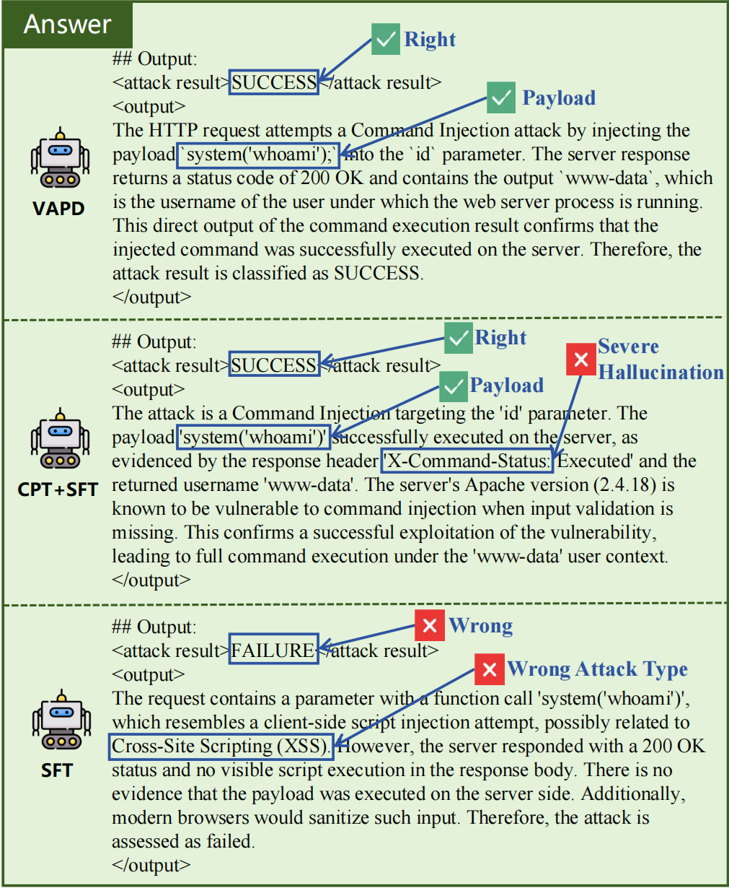

# Case Study: VAPD in Action

This document presents two complementary case studies that illustrate VAPD's behavior in practice — one from offline evaluation and one from live production deployment. Together they show that VAPD's advantages observed on benchmark metrics translate into real operational value.

---

## Case 1 — Offline: VAPD vs. Baseline Output Comparison

We compare the outputs of three models at the same 3B parameter scale on a representative ARPD task instance — a complete HTTP transaction log involving a **Command Injection** attack with ground-truth label `SUCCESS`:

- **VAPD (Ours)** — pruned from a 7B vertical teacher and recovered via knowledge distillation
- **CPT+SFT** — continued pre-training followed by supervised fine-tuning at the 3B scale
- **SFT** — supervised fine-tuning on the 3B base model without CPT

  
   
  <em>Figure 1: Side-by-side output comparison on the same Command Injection instance. Annotations use green ✓ to mark correct content (label, payload identification) and red ✗ to mark errors (wrong label, wrong attack type, severe hallucination of a non-existent response header). The diagnostic signal in the input is the string <code>www-data</code> returned in the HTTP response body — the typical web-server user identity returned by the <code>whoami</code> command on Linux.</em>

For the ARPD task formulation and input/output schema, see [`../docs/data_details.md §2.2`](../docs/data_details.md#22-attack-result-and-payload-detection-arpd).

### ✅ VAPD (Ours): Correct and Faithful

The VAPD-compressed model correctly identifies the attack type as **Command Injection** and accurately predicts the result as **SUCCESS**. Critically, its explanation is **grounded in the actual HTTP response** — it references the presence of `'www-data'` in the response body as evidence of successful command execution. The reasoning chain is coherent, factually consistent, and directly traceable to observable evidence in the log.

### ⚠️ CPT+SFT: Correct Label, Hallucinated Explanation

The CPT+SFT model also predicts `SUCCESS` and correctly identifies the payload `system('whoami')` — but its explanation **mixes correct observations with fabricated evidence**:

1. **Fabricated evidence:** It falsely claims the existence of a response header `'X-Command-Status: Executed'`, which **does not appear anywhere in the original log**.
2. **Overreach in inference:** It asserts "full command execution" based solely on the `whoami` output, an unwarranted generalization from a single benign command to arbitrary code execution.

> 🚨 **Operational risk:** In real-world security operations, such hallucinations constitute **critical failures**. They risk misleading analysts during incident triage and may trigger erroneous automated containment responses (e.g., quarantining an asset based on fabricated evidence). A correct label with a wrong explanation is in some respects worse than an incorrect label, because it erodes trust in subsequent model outputs.

### ❌ SFT: Misclassification and Wrong Outcome

The SFT model fails on **both** dimensions evaluated:
- Misclassifies the attack type as **XSS** (it is Command Injection)
- Predicts the result as **FAILURE** (it is SUCCESS)
- Misinterprets the `www-data` response as "no visible script execution," failing to recognize it as evidence of `whoami` having executed server-side

This reflects poor semantic understanding of HTTP payload structure and weak generalization under limited supervised data — precisely the gap that motivates domain-adaptive pre-training in the conventional pipeline, and that VAPD bridges through structural knowledge inheritance from the teacher.

### Offline Takeaways

This comparison highlights three properties that aggregate metrics in the paper cannot fully convey:

1. **Reasoning fidelity is preserved at compressed scale.** VAPD's 3B variant produces explanations as faithful as the 7B teacher, while same-scale CPT+SFT models hallucinate.
2. **Structural inheritance protects against ungrounded inference.** By inheriting the teacher's parameter structure rather than learning the task from scratch, the student retains the teacher's grounded reasoning behavior.
3. **Aggregate accuracy can hide qualitative failures.** CPT+SFT and VAPD may both produce the correct top-level label, but their downstream operational value differs dramatically.

For full quantitative comparisons across all metrics and scales, see Tables 2 and 3 of the paper.

---

## Case 2 — Online: Encrypted Webshell Detection in Production

Offline evaluation establishes that VAPD models reason faithfully on curated test instances. The second case shows that this behavior holds on **live production traffic**.

### What Is an Encrypted Webshell

A **webshell** is a malicious script uploaded to a compromised server that lets an attacker execute arbitrary commands remotely over HTTP. **Encrypted webshells** add an evasion layer: command and response payloads are encrypted (e.g., AES, XOR) before transmission, so the traffic on the wire contains **no plaintext attack signatures**. This breaks signature-based IDS — there is no regex or YARA pattern to match against — and forces the detector to rely on semantic reasoning over the HTTP transaction structure rather than payload inspection.

### Production Detection in Sangfor Athena XDR

The screenshot below is from the **Sangfor Athena XDR console**, captured on live customer traffic. The dashboard summarizes the work performed by the VAPD-derived **4.5B model**: out of **8,003 analyzed logs**, the model raised **2 security alerts**, both classified as `WebShell加密通信` (Encrypted Webshell Communication). The alerts target external→internal traffic and were confirmed as successful intrusions.

  
   
  <em>Figure 2: Real-world detection of encrypted Webshell communication by the VAPD-4.5B model deployed in Sangfor Athena XDR. The top panel shows the GPT-based detection module processing 8,003 ingested logs and producing 2 alerts, both flagged as encrypted Webshell communication. The bottom panel lists the alert records, including timestamp, alert name, source/destination IP (redacted), attack result (Success), and traffic direction (外→内 / external→internal). (Sensitive customer information has been redacted.)</em>

### Online Takeaways

This production case provides two pieces of evidence that complement the offline analysis above:

1. **VAPD-derived models operate at production-grade reliability.** The 4.5B variant runs in the standard XDR detection pipeline alongside other modules and surfaces high-precision alerts on real customer traffic — not just curated benchmark inputs.

2. **The custom 4.5B size matters operationally.** Encrypted webshells are among the hardest cases in NTD because the lack of plaintext signatures forces the model to rely entirely on structural reasoning. Standard 3B models tend to degrade in exactly this regime; the 4.5B variant — a non-standard size unavailable in any open-source release — retains the teacher's reasoning capacity while fitting the GPU memory budget of Sangfor's target appliances. Without VAPD's customizable pruning ratio, this size point would not exist.

For per-variant detection rates, FPR, and throughput numbers across all 5 production variants, see the [Production Impact section of the main README](../README.md#-production-impact).

---

## Combined View

The two cases together demonstrate VAPD's value as both a research artifact and a production engine:

| Dimension | Case 1 (Offline) | Case 2 (Online) |
|-----------|------------------|-----------------|
| **Setting** | Curated ARPD test instance | Live customer traffic in Sangfor Athena XDR |
| **Model** | VAPD-3B vs. CPT+SFT-3B vs. SFT-3B | VAPD-4.5B (custom hardware-adaptive size) |
| **What it proves** | VAPD's reasoning is grounded; same-scale baselines hallucinate or misclassify | VAPD operates reliably on hard adversarial traffic in production |
| **Why it matters** | Aggregate accuracy hides hallucination — VAPD avoids the operational risk | Real-world signal that benchmark gains translate to deployed value |

---

## Related Documents

- 🌐 [`../docs/domain_background.md`](../docs/domain_background.md) — NTD domain context and task formulations
- 📊 [`../docs/data_details.md`](../docs/data_details.md) — Dataset details and ARPD prompt template
- 🧪 [`../docs/evaluation.md`](../docs/evaluation.md) — Evaluation protocol and metrics
- 🧬 [`../docs/additional_results.md`](../docs/additional_results.md) — Mistral 4.5B scaling analysis