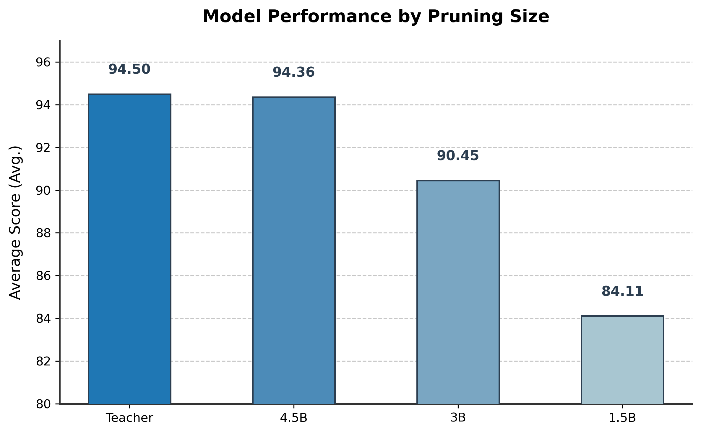

# Additional Experimental Results

This document presents supplementary experimental results that extend the main analyses in the paper.

## Mistral Family: Intermediate 4.5B Variant

While the main paper focuses on 3B and 1.5B variants of Mistral (Table 3), we additionally evaluate an intermediate **4.5B-parameter configuration** derived via VAPD. This variant is pruned to match a specific production hardware budget, demonstrating VAPD's ability to derive non-standard, hardware-optimized sizes beyond the discrete options of open-source releases.

  
   
  <em>Figure: Performance comparison of Mistral-7B teacher model and pruned variants (7B, 4.5B, 3B, 1.5B) on the NTD task.</em>

### Results

| Variant | Avg. Performance |
|---------|------------------|
| Mistral-7B (Teacher) | 94.50% |
| **Mistral-4.5B (VAPD)** | **94.36%** |
| Mistral-3B (VAPD) | 90.45% |
| Mistral-1.5B (VAPD) | 84.11% |

### Observations

The 4.5B variant achieves **near-teacher performance (94.36% vs. 94.50%)**, significantly surpassing the 3B (90.45%) and 1.5B (84.11%) variants. The performance gap between 7B and 4.5B is within 0.15 points—essentially at the noise floor of greedy-decoding evaluation.

This cross-architecture consistency corroborates the deployment success of the Qwen-2.5 4.5B variant discussed in Section 5 of the paper, confirming two properties of VAPD:

1. **Robustness across base architectures.** The same favorable scaling behavior observed on Qwen-2.5 also holds on Mistral, indicating that VAPD's benefits do not depend on architecture-specific quirks.
2. **Custom hardware-optimal sizing is viable.** VAPD can robustly derive intermediate sizes that maximize the throughput-accuracy tradeoff for specific deployment targets, without compromising critical domain knowledge.

### Implication: Toward Optimal Pruning Ratios

These results motivate an ongoing direction of our work: identifying **optimal pruning ratios** that balance inference efficiency against capability preservation. The 4.5B point appears to lie on a favorable region of the Pareto frontier—future work will characterize this frontier systematically and propose principled ratio-selection criteria.