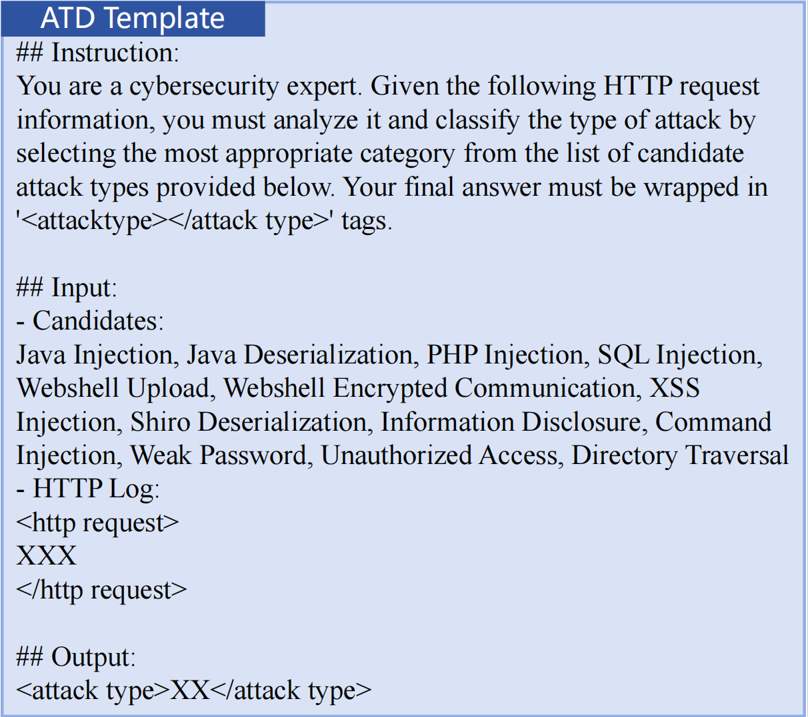
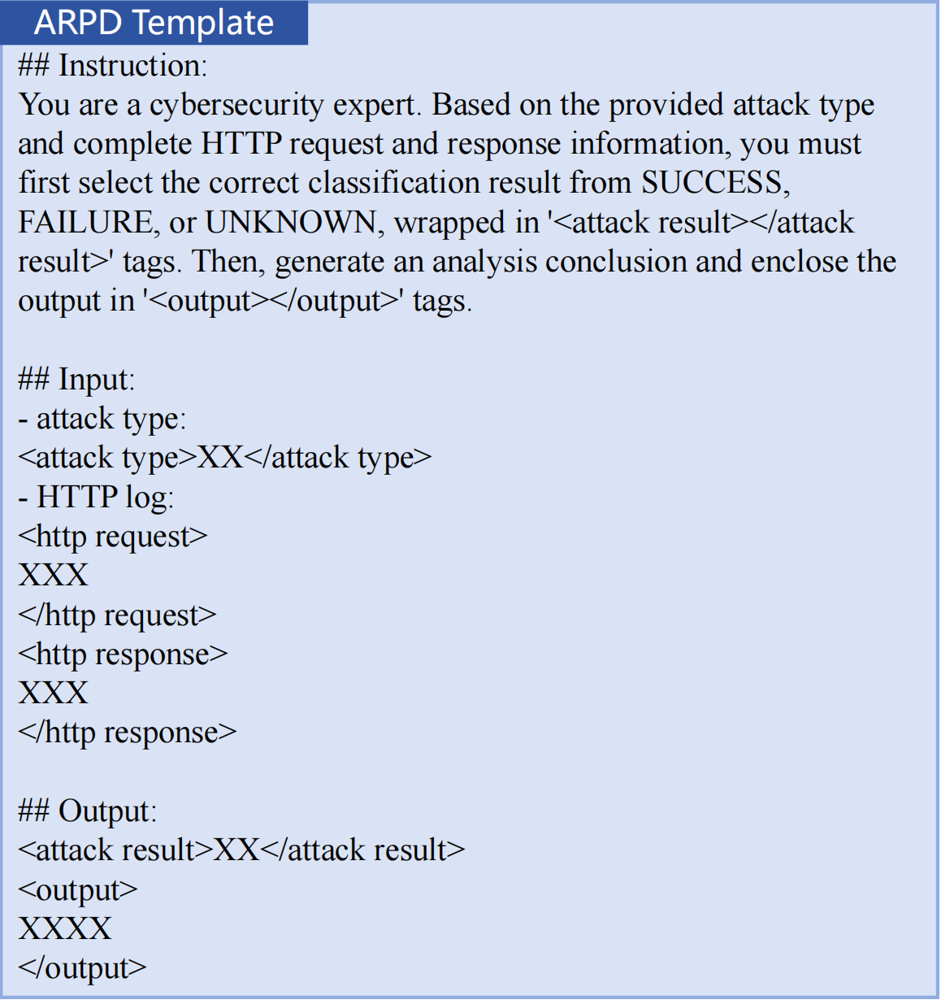

# Dataset Details

This document provides comprehensive details on all datasets used in VAPD, covering Continued Pre-training (CPT), Supervised Fine-tuning (SFT), and Knowledge Distillation (KD). It expands on Section 4.1.2 of the paper.

## 1. Continued Pre-Training (CPT) Data

To rapidly enhance open-source LLMs in cybersecurity scenarios while maintaining training stability, we construct a **200B-token mixed corpus** combining general and cybersecurity data at a **1:4 cybersecurity-to-general ratio**.

### 1.1 Cybersecurity Data (40B Tokens)

Collected through (1) web crawling and (2) extracting cybersecurity-related content from FineWeb using domain-specific keywords. The pipeline applies:

- **FastText-based classification filtering** to retain cybersecurity-relevant content
- **Special character removal** and normalization
- **Deduplication** at document and near-duplicate levels

The resulting 40B high-quality tokens span 9 categories, covering major cybersecurity data sources.

### 1.2 General Data (160B Tokens)

To ensure stable convergence during CPT and prevent catastrophic forgetting of general capabilities, we assemble a 160B-token general-purpose corpus through stratified sampling from open-source resources (FineWeb, WuDaoCorpora, WanJuan-CC). It spans six categories including English/Chinese knowledge, math, and code data.

### 1.3 Full Composition

| Type | Domain | # Samples | # Tokens |
|------|--------|-----------|----------|
| **General** | Books | 267,410 | 23.3B |
| | ArXiv | 39,143,709 | 30.2B |
| | Wiki | 18,000,000 | 15.9B |
| | News | 6,096,067 | 8.3B |
| | Code | 30,589,081 | 53.9B |
| | Math | 13,630,466 | 28.6B |
| **Cybersecurity** | Academic publications | 276,380 | 6.4B |
| | Wiki | 17,336,525 | 5.1B |
| | Books | 25,780 | 5.2B |
| | Forums | 9,015,500 | 3.2B |
| | Code | 2,799,000 | 8.2B |
| | Reports | 475,095 | 0.7B |
| | Vulnerability database | 4,440,802 | 5.4B |
| | Logs | 4,506,726 | 5.0B |
| | News | 1,872,540 | 1.0B |

> **Sources omitted for brevity.** Public corpora used include FineWeb, WuDaoCorpora, and WanJuan-CC. Proprietary cybersecurity sources cannot be redistributed due to licensing and customer-data constraints.

## 2. SFT and KD Data

The unified training set for SFT and KD comprises **149,501 samples (480M tokens)**, structured into two complementary subsets:

- **ATD** — Attack Type Detection
- **ARPD** — Attack Result and Payload Detection

### 2.1 Attack Type Detection (ATD)

The ATD dataset uses standardized HTTP request templates with randomized payloads as input. Each sample is annotated by cybersecurity experts with **one of 13 attack categories**.

**Class distribution:** see [`domain_background.md §3`](domain_background.md#3-attack-taxonomy-13-categories) for per-class training and test sample counts across all 13 attack types.
**Input template:**

  
   
  <em>ATD prompt template, showing the system instruction, the list of 13 candidate attack types, and the placeholder for the HTTP request log.</em>

### 2.2 Attack Result and Payload Detection (ARPD)

ARPD extends ATD by incorporating **full HTTP transaction logs (request + response)**. Each sample is annotated with one of three attack results:

- **SUCCESS** — attacker objective achieved
- **FAILURE** — attack clearly unsuccessful
- **UNKNOWN** — indeterminable from logs

Annotations are produced by GPT-4 and reviewed by cybersecurity experts.

**Class distribution:**

| Attack Result | Training Samples | Test Samples |
|---------------|------------------|--------------|
| SUCCESS | 66,802 | 745 |
| FAILURE | 65,798 | 649 |
| UNKNOWN | 16,901 | 160 |
| **Total** | **149,501** | **1,554** |

The dataset size matches ATD because ARPD inputs incorporate ATD's final outputs (the detected label `ψ`).

**Input template:**

  
   
  <em>ARPD prompt template, showing the instruction, the attack type input (from ATD's output), the HTTP request/response placeholders, and the dual-tag output format (attack result + analysis).</em>

## 3. Calibration Data for Pruning

In addition to CPT/SFT/KD data, VAPD's pruning stage requires a small **calibration dataset** for computing Taylor importance scores (Section 3.2.2 of the paper). We construct calibration data as a **3:1 mixture of domain-specific and general-domain instances**.

- **Domain subset** anchors gradient computation to the target NTD task
- **General subset** acts as a regularizer against overfitting to limited domain samples

The optimal 3:1 ratio is empirically determined in Section 4.3.3 of the paper. Implementation details and a sampling script template will be released under `vapd/pruning/calibration.py` *(coming with the code release)*.

## 4. Open-Source Plan

Sangfor Technologies plans to open-source a **portion of the ATD and ARPD datasets** to support further research in AI-driven cybersecurity. The release scope and timeline will be announced in this repository.

> ⚠️ **Note:** Full datasets cannot be released due to (1) customer-data privacy constraints and (2) the operational security risk of disclosing real attack signatures from production telemetry. The released portion will be carefully curated to balance research utility with these constraints.

---

## Related Documents

- 🧪 [`evaluation.md`](evaluation.md) — Evaluation protocol and metrics
- 🌐 [`domain_background.md`](domain_background.md) — Domain context and task formulations
- 🔍 [`../case_studies/vapd_vs_baseline.md`](../case_studies/vapd_vs_baseline.md) — Qualitative output comparison