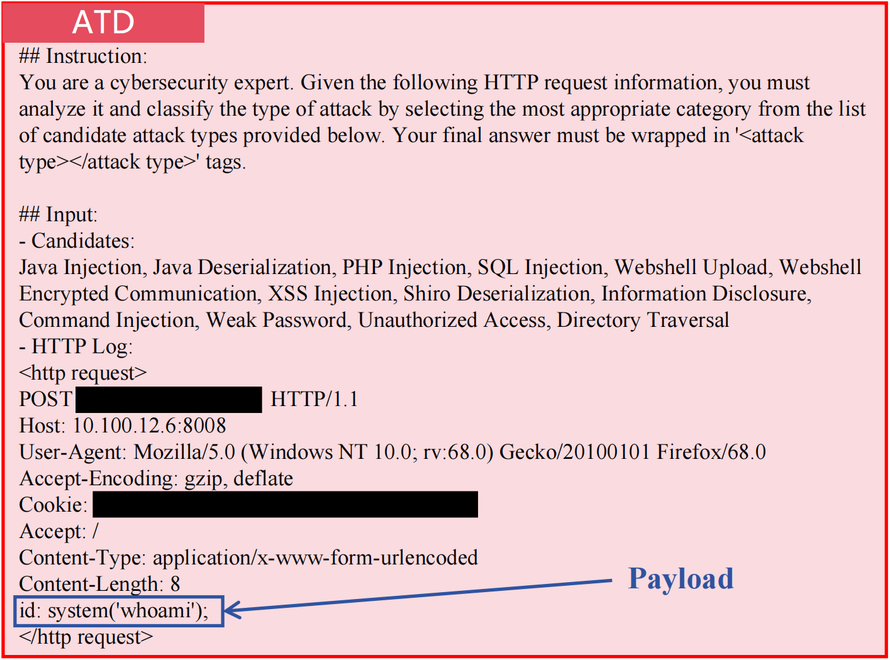
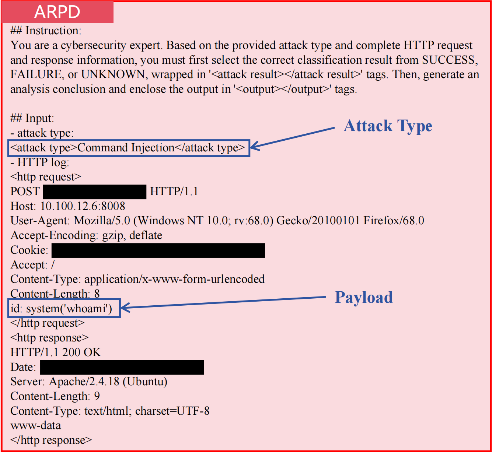

# Evaluation Protocol

This document details the evaluation protocol for the Network Traffic Detection (NTD) scenario. It expands on Section 4.1.5 of the paper and complements [`data_details.md`](data_details.md).

## 1. Test Sets

We evaluate on two task-specific test sets, each containing **1,554 samples**:

- **ATD test set** — 13-class classification (distribution in [`data_details.md §2.1`](data_details.md#21-attack-type-detection-atd))
- **ARPD test set** — 3-class classification + payload extraction (distribution in [`data_details.md §2.2`](data_details.md#22-attack-result-and-payload-detection-arpd))

All decoding is **deterministic and greedy (temperature = 0)** to eliminate evaluation randomness.

## 2. Metrics

### 2.1 ATD: Weighted Precision and Recall

ATD is a 13-class classification task. We report **weighted precision and recall**:

- Computed per-class, then averaged **weighted by class size**
- This reflects the natural distribution of attack types in production traffic, where some attack vectors are more common than others
- Larger classes contribute proportionally more to the final metric

### 2.2 ARPD: Three-Class Accuracy + Payload Recovery Rate

ARPD has two scoring dimensions:

- **Attack outcome accuracy** — standard accuracy on the 3-class label (SUCCESS / FAILURE / UNKNOWN); the fraction of test samples for which the predicted result exactly matches the ground-truth label.
- **Payload Recovery Rate (PRR)** — verifies that the model's extracted payload **completely contains** the ground-truth malicious fragment. This is stricter than partial overlap: missing any portion of the payload counts as a failure.

### 2.3 Aggregate Score

The individual metrics — weighted precision/recall (ATD) and accuracy (ARPD) — are aggregated into a single overall **Average** score (reported as a percentage) for holistic comparison across models and methods.

## 3. Example Inputs

### 3.1 ATD Example

  
   
  <em>An ATD task instance representing a Command Injection attack. The malicious <strong>Payload</strong> (<code>system('whoami');</code>) injected into the <code>id</code> parameter is highlighted. (Sensitive information has been removed.)</em>

### 3.2 ARPD Example

  
   
  <em>An ARPD task instance representing a Command Injection attack with a SUCCESS outcome. Annotations highlight the input <strong>Attack Type</strong> (from ATD), the malicious <strong>Payload</strong>, and the full HTTP request/response. The string <code>www-data</code> in the response body is the diagnostic signal for successful command execution. (Sensitive information has been removed.)</em>

## 4. What Aggregate Metrics Cannot Capture

An important caveat for vertical-domain deployment: aggregate accuracy can **mask qualitative failures** that matter operationally. Two models with identical top-level accuracy may differ drastically in:

- **Reasoning fidelity** — whether the explanation is grounded in the actual log or fabricated
- **Downstream trust** — whether analysts can rely on the model's justifications during incident triage
- **Automation safety** — whether automated playbooks triggered by the model's output act on real or imagined evidence

See [`../case_studies/vapd_vs_baseline.md`](../case_studies/vapd_vs_baseline.md) for a concrete demonstration where CPT+SFT and VAPD-derived 3B models both produce the correct attack-result label, yet diverge sharply on these qualitative dimensions—VAPD remains faithful to the log while CPT+SFT hallucinates response headers that do not exist.

---

## Related Documents

- 📊 [`data_details.md`](data_details.md) — Full dataset composition and distributions
- 🌐 [`domain_background.md`](domain_background.md) — Domain context and task formulations
- 🧬 [`additional_results.md`](additional_results.md) — Supplementary results (Mistral 4.5B variant)